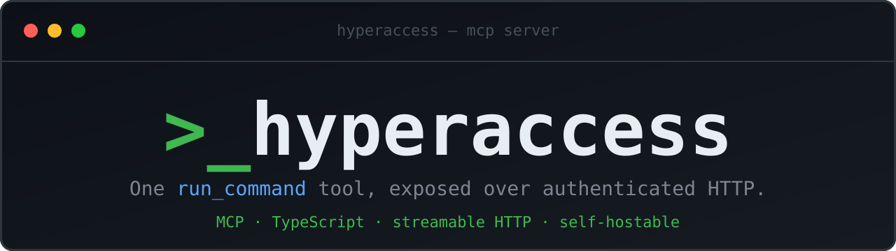

<p align="center">
  
</p>

<h1 align="center">hyperaccess</h1>

<p align="center">
  <a href="https://modelcontextprotocol.io"></a>
  <a href="#requirements">= 20.12"></a>
  
  <a href="LICENSE"></a>
  <a href="https://github.com/TheSolyboy/hyperaccess/stargazers"></a>
</p>

<p align="center">
  A minimal <a href="https://modelcontextprotocol.io">MCP</a> server that exposes a single tool —
  <code>run_command</code> — over authenticated HTTP. Connect it to an MCP client
  (Claude Code, Claude Desktop, …) and let the client run shell commands on a
  machine you control. One file, no database, no runtime bloat.
</p>

---

## ⚠️ Security warning

`run_command` runs **arbitrary commands with no whitelist**. Anyone holding a
valid API key can run anything as the user the server runs as. Treat the API
key like a root password.

- Keep `.env` secret. It is git-ignored and created with `chmod 600`.
- The server binds to `127.0.0.1` by default. Do **not** set `HOST=0.0.0.0`
  unless the server sits behind a tunnel or proxy with its own access control.
- The server refuses to start as `root`.
- For remote access, prefer a tunnel (see [Exposing it publicly](#exposing-it-publicly-optional))
  over opening a port directly to the internet. Once public, the API key is the
  only thing protecting an arbitrary-command-execution endpoint.

---

## Features

<table>
<tr><td><b>One focused tool</b></td><td><code>run_command</code> runs a shell command and returns <code>stdout</code>, <code>stderr</code>, <code>exitCode</code>, <code>signal</code> and <code>timedOut</code> as structured output.</td></tr>
<tr><td><b>Authenticated</b></td><td>API key required on every request — via the <code>x-api-key</code> header or an <code>?api_key=</code> query parameter. Constant-time comparison, <code>401</code> on mismatch.</td></tr>
<tr><td><b>Streamable HTTP</b></td><td>Modern MCP transport, stateless — each request is fully independent. No SSE session bookkeeping.</td></tr>
<tr><td><b>Safe by default</b></td><td>Binds to localhost, refuses to run as root, configurable command timeout and output cap.</td></tr>
<tr><td><b>One-command install</b></td><td><code>./install.sh</code> checks Node.js, builds, generates a key, and optionally installs a systemd service.</td></tr>
<tr><td><b>Tiny</b></td><td>~200 lines of TypeScript. Three dependencies: the MCP SDK, <code>express</code> and <code>zod</code>.</td></tr>
</table>

---

## Requirements

- Node.js >= 20.12 (uses the built-in `--env-file` flag).
- Linux with systemd for the background service. The server itself runs
  anywhere Node.js does.

## Quick start

```bash
git clone https://github.com/TheSolyboy/hyperaccess.git
cd hyperaccess
./install.sh
```

The installer checks Node.js, installs dependencies, builds the project,
creates `.env` with a freshly generated API key, and optionally installs and
starts the systemd service. The generated key is printed once — save it.

## Manual setup

```bash
npm install
npm run build
cp .env.example .env          # then set API_KEY
npm start
```

Generate a key with `openssl rand -hex 32`.

## Configuration

All configuration lives in `.env`:

| Variable             | Default       | Description                                       |
| -------------------- | ------------- | ------------------------------------------------- |
| `API_KEY`            | *(required)*  | Key clients must present to authenticate.         |
| `PORT`               | `3420`        | Port the server listens on.                       |
| `HOST`               | `127.0.0.1`   | Bind address. `0.0.0.0` = all interfaces.         |
| `COMMAND_TIMEOUT_MS` | `0`           | Max runtime per command. `0` = no timeout.        |
| `MAX_OUTPUT_BYTES`   | `10485760`    | Max stdout/stderr bytes captured per command.     |

## Authentication

The API key can be sent two ways:

1. **Header** — `x-api-key: YOUR_API_KEY` (preferred).
2. **Query parameter** — `?api_key=YOUR_API_KEY` on the URL, for clients that
   cannot send custom headers.

Both grant the same access. The query parameter ends up in URLs and may leak
into logs (proxies, tunnels), so prefer the header where possible.

## Running as a service (systemd)

The installer can do this for you. To do it manually, fill in the placeholders
in `hyperaccess.service` (`__USER__`, `__PROJECT_DIR__`, `__NODE_BIN__`) and:

```bash
sudo cp hyperaccess.service /etc/systemd/system/hyperaccess.service
sudo systemctl daemon-reload
sudo systemctl enable --now hyperaccess
```

Status and logs:

```bash
systemctl status hyperaccess
journalctl -u hyperaccess -f
```

If Node.js is installed via a version manager (nvm, fnm, …), its binary is not
on the system `PATH`, so `ExecStart` must use an absolute path. Find it with
`which node`.

## Connecting from an MCP client

The server uses the `http` transport. Base URL: `http://127.0.0.1:3420/mcp`
(or your public URL if you expose it).

### Claude Code (CLI)

```bash
claude mcp add --transport http hyperaccess http://127.0.0.1:3420/mcp \
  --header "x-api-key: YOUR_API_KEY"
```

### Claude Desktop

Add to `claude_desktop_config.json`:

```json
{
  "mcpServers": {
    "hyperaccess": {
      "type": "http",
      "url": "http://127.0.0.1:3420/mcp",
      "headers": { "x-api-key": "YOUR_API_KEY" }
    }
  }
}
```

### Clients without custom-header support

Put the key in the URL instead:

```
http://127.0.0.1:3420/mcp?api_key=YOUR_API_KEY
```

## Exposing it publicly (optional)

The server only binds to `127.0.0.1`, so to reach it from outside the host put
it behind a tunnel rather than opening a port. With
[Cloudflare Tunnel](https://developers.cloudflare.com/cloudflare-one/connections/connect-networks/):

```bash
cloudflared tunnel login
cloudflared tunnel create hyperaccess
```

Add an ingress rule to your tunnel config:

```yaml
ingress:
  - hostname: hyperaccess.example.com
    service: http://127.0.0.1:3420
  - service: http_status:404
```

Route DNS and run the tunnel:

```bash
cloudflared tunnel route dns hyperaccess hyperaccess.example.com
cloudflared tunnel run hyperaccess
```

Once public, consider an extra layer such as Cloudflare Access, mTLS, or an IP
allowlist on top of the API key.

## Testing without an MCP client

```bash
# Health check (no auth)
curl -s http://127.0.0.1:3420/health

# initialize handshake
curl -s http://127.0.0.1:3420/mcp \
  -H "Content-Type: application/json" \
  -H "Accept: application/json, text/event-stream" \
  -H "x-api-key: YOUR_API_KEY" \
  -d '{"jsonrpc":"2.0","id":1,"method":"initialize","params":{"protocolVersion":"2025-06-18","capabilities":{},"clientInfo":{"name":"curl","version":"0"}}}'
```

A wrong or missing key returns `401`.

## Endpoints

| Method + path  | Auth | Description                          |
| -------------- | ---- | ------------------------------------ |
| `POST /mcp`    | Yes  | MCP messages (streamable HTTP).      |
| `GET /mcp`     | Yes  | `405` — unused in stateless mode.    |
| `DELETE /mcp`  | Yes  | `405` — unused in stateless mode.    |
| `GET /health`  | No   | `{"status":"ok"}` for monitoring.    |

## Star history

<a href="https://star-history.com/#TheSolyboy/hyperaccess&Date">
  
</a>

## License

[MIT](LICENSE)
